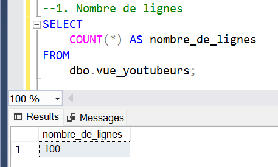
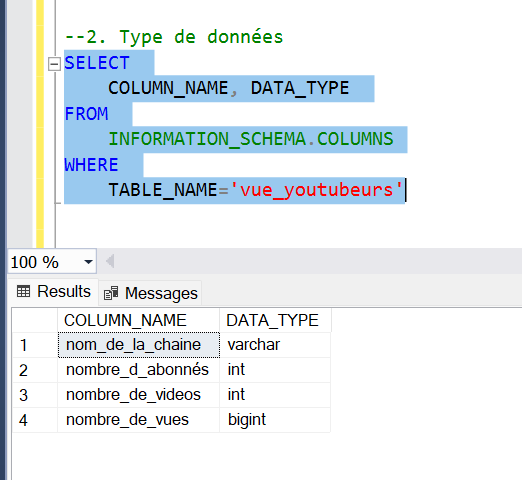
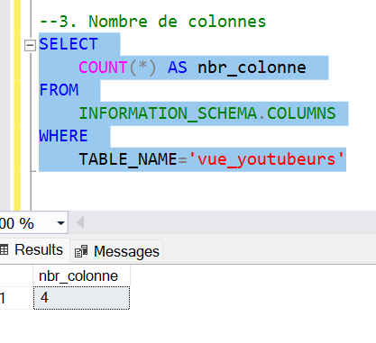

# Objectif

A travers cette étude je cherche à identifier les chaines YouTube les plus performants en France en 2024, en se basant sur des critères tels que le nombre de vidéos publiées, d'abonnés et de vues.

- La solution proposée

Créer un tableau de bord fournissant les insights sur les chaines YouTube les plus performantes en France en 2024, y compris:

- Le nombre d'abonnés
- Le nombre de vues
- Les vues par abonné
- Le nombre de vidéos, et
- L'engagement communautaire

# Source du jeu de données

- D'où proviennent les données?
  Les données initiales proviennent de Kaggle, sous forme d’un extrait Excel, [Disponipble ic.](https://www.kaggle.com/datasets/bhavyadhingra00020/top-100-social-media-influencers-2024-countrywise?resource=download). Elles ont ensuite été enrichies à l'aide de l'API de YouTube.

# Les etapes

- Collecte des données
- Exploration des données sur Excel
- Chargement des données dans Microsoft SQL Server
- Nettoyage des données
- Tester les donner
- Visualiser les données
- Rediger la documentation

## Les outils

| Outil      | But                                                 |
| ---------- | --------------------------------------------------- |
| Excel      | Exploration des données                             |
| SQL Server | Nettoyage, test, et analyse des données             |
| Power BI   | Visualisation des données via un dashord interactif |
| GitHub     | Hebergelent du projet et du rapport                 |

# Development

## Data exploration notes

A cette etape de l'analysis voici les observations qui ont été faites:

- What are your initial observations with this dataset? What's caught your attention so far?

1. Les colonnes dont on a besoin pour faire l'analyse sont au nombre de 4 et elles sont toutes presentes
2. La première colonne(Name) semble contenir des identifiants de chaînes, séparés par un symbole @. Nous devons extraire les noms des chaînes à partir de ces données.
3. Le jeu de données contient plus d’informations que nécessaire, il faudra donc supprimer les colonnes superflues.

## Data cleaning

L’objectif est d’affiner notre jeu de données pour qu’il soit bien structuré, complet et prêt pour l’analyse.

Les données nettoyées doivent respecter les critères et contraintes suivants :

- Pertinence : Seules les colonnes nécessaires à l’analyse doivent être conservées.
- Cohérence : Les types de données doivent être adaptés au contenu de chaque colonne (par exemple, les colonnes numériques ne doivent pas contenir de texte, et les dates doivent suivre un format standard).
- Complétude : Aucune colonne ne doit contenir de valeurs nulles, afin de garantir des informations complètes pour chaque enregistrement.

- Processus de nettoyage du jeu de données

1. Selectionner les colonnes necessaires pour la suite
2. Extraire le non des chaines dans la premiere colonne
3. Utiliser les alias pour renommer les coonnes

### Transformation

```sql
/*
# 1. Ne conserver que les donn�es pertinantes pour la suite
# 2. Extraction du nom de la chaine
# 3. Renommer les chaines
# 4. Créer une vue
*/

CREATE VIEW	vue_youtubers AS
    SELECT
        CAST(SUBSTRING(NAME, 1, (CHARINDEX('@',NAME))-1) AS varchar(255))  AS nom_de_la_chaine,
        total_subscribers AS nombre_d_abonnés ,
        total_videos AS nombre_de_videos ,
        total_views AS nombre_de_vues
    FROM
        top_youtubeurs_français
```

# Tests

## Verification du nombre de lignes

```sql
/*
# Tester la qualité des données:
# Absence de données manquantes(Nombre de lignes)
*/

SELECT
    COUNT(*) AS nombre_de_lignes
FROM
    dbo.vue_youtubeurs;

```



## Verification type des colonnes

```sql
/*
# Type des colonnes
*/

SELECT
    COLUMN_NAME, DATA_TYPE
FROM
    INFORMATION_SCHEMA.COLUMNS
WHERE
    TABLE_NAME='vue_youtubeurs'

```



## Nombre de colonnes

```sql
/*
# Nombre de colonnes
*/

SELECT
    COUNT(*) AS nbr_colonne
FROM
    INFORMATION_SCHEMA.COLUMNS
WHERE
    TABLE_NAME='vue_youtubeurs'
```



## Absence de doublons

```sql
/*
# Absence de doublons
*/

SELECT
    nom_de_la_chaine, COUNT(nom_de_la_chaine)
FROM
    vue_youtubeurs
GROUP BY
    nom_de_la_chaine
HAVING
    COUNT(nom_de_la_chaine)>1;

```

.png)

# Visualisation des données

## Resultats


## Mesures DAX

### 1. Nombre d'abonnés (M)

```sql
Nombre d_abonnes (M) =
VAR million = 1000000
VAR sommeAbonnes = SUM(vue_youtubeurs[nombre_d_abonnés])
VAR totalAbonnes = DIVIDE(sommeAbonnes, million)

RETURN totalAbonnes

```

### 2. Nombre de videos

```sql
Nombre de videos =
VAR sommeVideo = SUM(vue_youtubeurs[nombre_de_videos])

RETURN sommeVideo

```

### 3. Nombre de vues

```sql

Nombre de vues(Mrd) =
VAR milliard = 1000000000
VAR somme_des_vues = SUM(vue_youtubeurs[nombre_de_vues])
VAR nbr_total_vues = DIVIDE(somme_des_vues, milliard)

RETURN nbr_total_vues

```

### 4. Nombe de vue moyenne par video

```sql

Nombe de vue moyenne par video(M) =
VAR totalVue = SUM(vue_youtubeurs[nombre_de_vues])
VAR totalVideo = SUM(vue_youtubeurs[nombre_de_videos])
VAR moyenVueParVideo= DIVIDE(totalVue,totalVideo, BLANK())
VAR moyenne = DIVIDE(moyenVueParVideo, 1000000, BLANK())

RETURN moyenne

```

### 5. Engagement communautaire

```sql
Réactivité_abonnés =
VAR totalVideos = SUM(vue_youtubeurs[nombre_de_videos])
VAR totalAbonnes = SUM(vue_youtubeurs[nombre_d_abonnés])
VAR ratio = DIVIDE(totalAbonnes, totalVideos, BLANK())

RETURN ratio

```

### 6. Nombre de vues par abonnés

```sql

Nombre de vues par abonnés =
VAR totalVues= SUM(vue_youtubeurs[nombre_de_vues])
VAR totalAbonnes = SUM(vue_youtubeurs[nombre_d_abonnés])
Var vueParAbonnes = DIVIDE(totalVues, totalAbonnes, BLANK())

RETURN vueParAbonnes

```

# CONCLUSION DE L’ANALYSE

Dans cette analyse des chaînes YouTube les plus performantes en France, j'ai exploré un jeu de données contenant 100 chaînes et examiné plusieurs indicateurs de performance, dont le nombre d'abonnés, de vues, et de vidéos publiées. À travers divers tableaux et graphiques interactifs dans Power BI, j'ai identifié les chaînes les plus populaires et les plus engageantes selon trois aspects principaux :

1. Vue d'ensemble des performances des chaînes : Un tableau interactif présente les chaînes YouTube avec leur nombre d'abonnés, de vues, et de vidéos publiées, offrant une comparaison directe entre ces indicateurs pour une vue d'ensemble des performances.

2. Top 10 des chaînes les plus vues et les plus suivies : Grâce à un treemap des 10 chaînes les plus vues et un graphique à barres des 10 chaînes avec le plus d'abonnés, j'ai mis en évidence les créateurs ayant le plus d’impact et d’attractivité en France.

3. Analyse de l’engagement et de la fidélité : Pour aller au-delà des chiffres bruts, des métriques avancées telles que le nombre de vues par abonné, la réactivité des abonnés par vidéo, et le nombre moyen de vues par vidéo ont été intégrées. Ces indicateurs permettent d’évaluer la fidélité et l’engagement réel des audiences, mettant en lumière les chaînes dont les abonnés interagissent davantage avec le contenu, ce qui est essentiel pour comprendre la qualité de la relation entre créateur et public.

Pour valider l’exactitude des résultats affichés dans le dashboard, j’ai effectué des requêtes SQL pour vérifier les calculs de Power BI. Les résultats obtenus sont conformes, ce qui renforce la fiabilité des insights.

# RECOMMANDATIONS ET PERSPECTIVES

Les résultats de cette analyse des chaînes YouTube en France ouvrent plusieurs pistes d'approfondissement et de recommandations :

1. Stratégies de contenu optimisée : Les chaînes affichant les meilleurs taux d’engagement et de fidélité offrent des modèles de bonnes pratiques pour d’autres créateurs, notamment en matière de types de contenus, fréquence de publication, et format des vidéos.

2. Étude temporelle et tendances : Il pourrait être intéressant de compléter cette analyse avec une dimension temporelle pour observer les tendances de croissance des vues et abonnés et leur lien avec des événements spécifiques, comme des lancements de vidéos ou des collaborations.

3. Analyse comparative internationale : Comparer les chaînes françaises avec des chaînes internationales dans des catégories similaires pourrait offrir des perspectives sur les meilleures pratiques mondiales, particulièrement pour des mesures d’engagement similaires.

Ces perspectives, associées aux données actuelles, peuvent guider les créateurs, les marques, et les analystes du secteur digital dans la construction de stratégies de contenu YouTube plus ciblées et efficaces.
